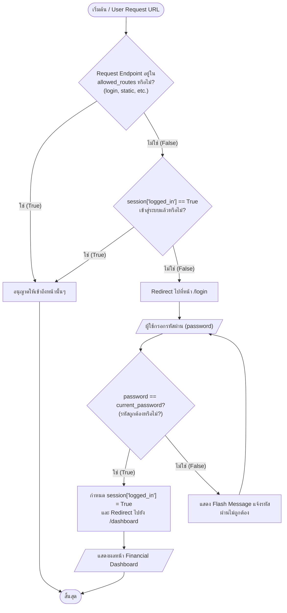
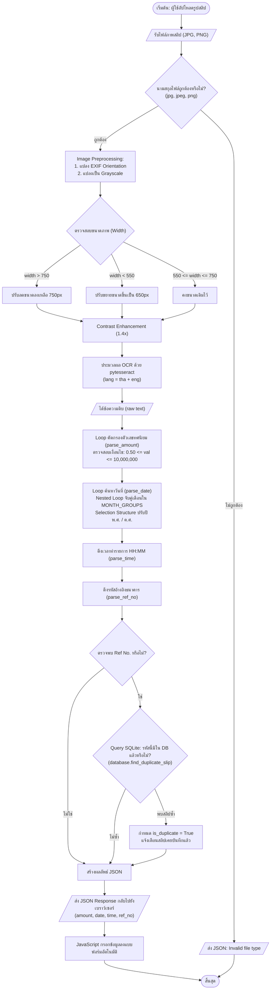
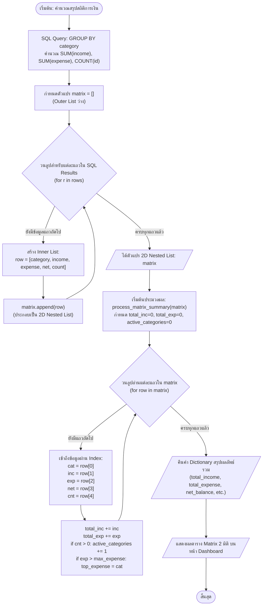

# SlipMoney 💸 - Flowcharts & System Architecture

เอกสารผังงาน (Flowchart) ของระบบ **SlipMoney** จำลองและอ้างอิงตรงกับ **Python Source Code จริง** ของโปรเจกต์ แสดง Input → Process → Output, Decision Structure (`if`), และ Repetition Structure (`for` loop) ครบถ้วนตามข้อกำหนด

---

## 1. Flowchart: ระบบตรวจสอบสิทธิ์การเข้าสู่ระบบ (Authentication & Route Guard)
อ้างอิงโค้ดจริงจาก [`app.py`](file:///c:/Users/Ghost%20Spectre/Documents/CMU/954142/Project/app.py) บรรทัดที่ 70–136 (`check_authentication`, `login`)

---

## 2. Flowchart: ระบบอ่านสลิปธนาคารด้วย OCR (Slip OCR Auto-Fill Engine)
อ้างอิงโค้ดจริงจาก [`ocr_service.py`](file:///c:/Users/Ghost%20Spectre/Documents/CMU/954142/Project/ocr_service.py) บรรทัดที่ 48–355 และ [`app.py`](file:///c:/Users/Ghost%20Spectre/Documents/CMU/954142/Project/app.py) บรรทัดที่ 271–337 (`api_ocr_slip`)

---

## 3. Flowchart: ระบบประมวลผล 2D Nested List (Category Financial Matrix)
อ้างอิงโค้ดจริงจาก [`database.py`](file:///c:/Users/Ghost%20Spectre/Documents/CMU/954142/Project/database.py) บรรทัดที่ 465–550 (`get_financial_summary_matrix`, `process_matrix_summary`)

---

## 4. ตารางเปรียบเทียบ Flowchart กับ Source Code จริง

| องค์ประกอบใน Flowchart | บรรทัดใน Source Code | หน้าที่การทำงาน |
| :--- | :--- | :--- |
| **Authentication Decision (`if`)** | `app.py: 74–79` | ตรวจสอบว่า endpoint ได้รับอนุญาต หรือ session เข้าสู่ระบบแล้วหรือไม่ |
| **Password Match Decision (`if-else`)** | `app.py: 110–115` | ตรวจสอบความถูกต้องของรหัสผ่าน `1234` |
| **File Extension Decision (`if`)** | `app.py: 285–286` | ป้องกันการอัปโหลดไฟล์แปลกปลอม รับเฉพาะ `.jpg, .jpeg, .png` |
| **Image Resize Decision (`if-elif-else`)** | `ocr_service.py: 68–76` | ปรับขนาดภาพตามเกณฑ์ความกว้าง เพื่อให้ OCR ภาษาไทยแม่นยำและรวดเร็ว |
| **Buddhist Era Conversion (`nested-if`)** | `ocr_service.py: 50–57` | แปลงปี พ.ศ. 4 หลัก และ 2 หลัก เป็น ค.ศ. สากล |
| **Month Matching Loop (`nested for`)** | `ocr_service.py: 45–56` | วนลูปเปรียบเทียบชื่อและตัวย่อเดือน 12 เดือน |
| **Amount Validation Loop (`for`)** | `ocr_service.py: 117–124` | วนลูปกรองตัวเลขทศนิยมที่อยู่ในช่วงธุรกรรม 0.50 – 10,000,000 บาท |
| **Duplicate Ref No. Check (`if`)** | `app.py: 301–306` | เรียก `database.find_duplicate_slip()` เพื่อแจ้งเตือนสลิปซ้ำ |
| **2D Nested List Construction Loop (`for`)**| `database.py: 502–513` | วนลูปสร้างแถว `[cat, inc, exp, net, count]` แล้ว `matrix.append(row)` |
| **2D Nested List Index Access Loop (`for`)** | `database.py: 531–545` | วนลูปอ่านข้อมูลผ่าน Index `row[0]`, `row[1]`, `row[2]` ฯลฯ |
